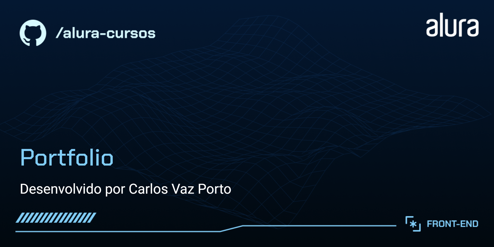

# Portfolio

Portfolio desenvolvido com os cursos de HTMEL e CSS da Alura.

## 🔨 Funcionalidades do projeto

Portfolio com navegação entre as páginas do mesmo e acesso a links externos de certificados de cursos.

## ✔️ Técnicas e tecnologias utilizadas

As técnicas e tecnologias utilizadas pra isso são:

- `HTML5`: linguagem de marcação
- `CSS3`: linguagem de estilização
- `CSS Flexbox`: recurso do CSS para posicionamento de itens
- `VSCode`: editor de códigos
- `Github`: repositório dos arquivos
